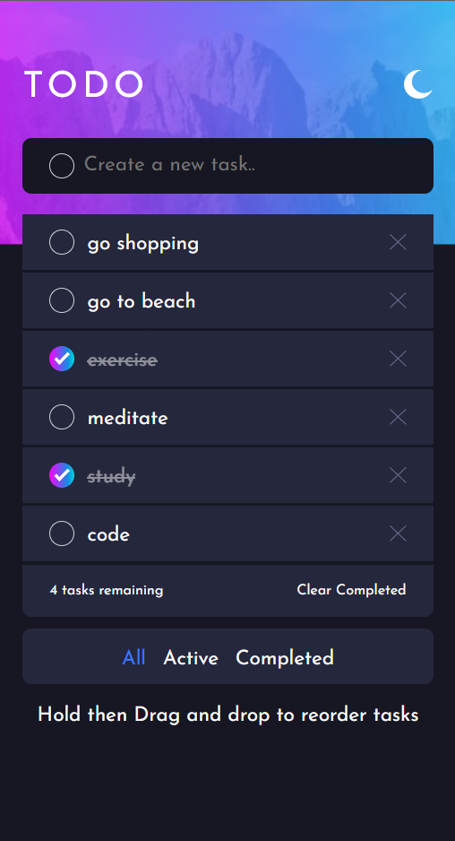
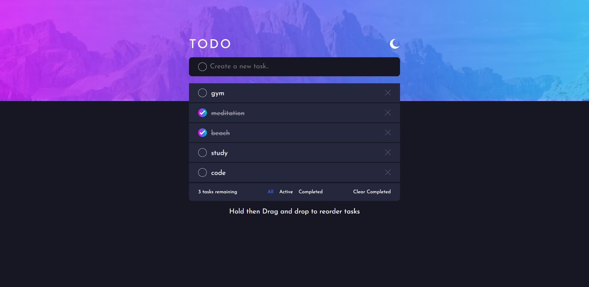

# Frontend Mentor - Todo app solution

This is a solution to the [Todo app challenge on Frontend Mentor](https://www.frontendmentor.io/challenges/todo-app-Su1_KokOW). Frontend Mentor challenges help you improve your coding skills by building realistic projects.

## Table of contents

- [Overview](#overview)
  - [The challenge](#the-challenge)
  - [Screenshot](#screenshot)
  - [Links](#links)
- [My process](#my-process)
  - [Built with](#built-with)
  - [What I learned](#what-i-learned)
  - [Useful resources](#useful-resources)
- [Author](#author)

**Note: Delete this note and update the table of contents based on what sections you keep.**

## Overview

### The challenge

Users should be able to:

- View the optimal layout for the app depending on their device's screen size
- See hover states for all interactive elements on the page
- Add new todos to the list
- Mark todos as complete
- Delete todos from the list
- Filter by all/active/complete todos
- Clear all completed todos
- Toggle light and dark mode
- **Bonus**: Drag and drop to reorder items on the list
- **Bonus**: Added localstorage functionality

### Screenshot

<!-- 
 -->

<div style="display:flex;gap:30px">


</div>

### Links

[- Solution URL ](https://github.com/vinit-churi/todo-app-main)

[- Live Site URL (github pages)](https://vinit-churi.github.io/todo-app-main/)

## My process

### Built with

- Semantic HTML5 markup
- CSS custom properties
- Flexbox
- CSS Grid
- Mobile-first workflow
- [SortableJS](https://github.com/SortableJS/Sortable/) - Sortable is a JavaScript library for reorderable drag-and-drop lists.

### What I learned

[HTML <**template**> tag: hold some content that will be hidden when the page loads. Use JavaScript to display it](https://developer.mozilla.org/en-US/docs/Web/HTML/Element/template)

```html
<template id="task-template">
  <li class="task">
    <input class="task-input" type="checkbox" />
    <label>
      <span class="custom_checkbox"></span>
    </label>
    <span class="deleteBtn">
      
    </span>
  </li>
</template>
```

### Useful resources

- [YouTube](https://www.youtube.com/watch?v=W7FaYfuwu70&t=1252s) - This helped me to understand the **template** tag and how to use it

## Author

- Website - [vinit](https://vinit-churi.github.io/todo-app-main/)
- Frontend Mentor - [@RedSquirrrel](https://www.frontendmentor.io/profile/vinit-churi)
